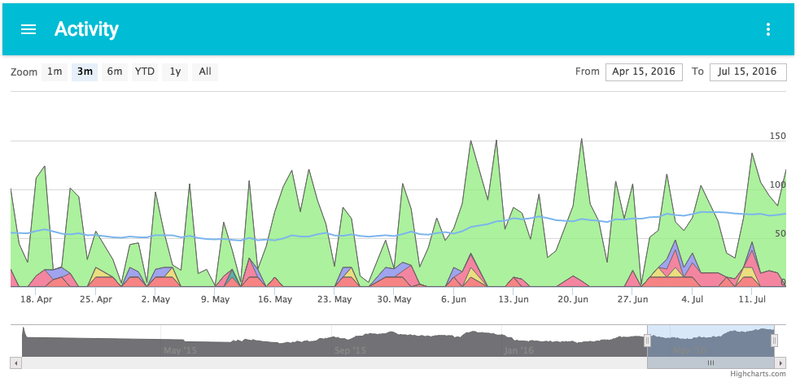

# FitnessActivityGraph

This directory contains the code for a graph widget that displays a fitness activity
graph based on data from the [Google Fit](http://fit.google.com) API.

This widget requires that you add the [OAuth2 apps script
library](https://github.com/googlesamples/apps-script-oauth2) as a library for
your project.



# Setup

# Requirements

1. node
1. npm
1. gulp
 
## Install dependencies

Run npm:

```console
$ npm install
```
 
You may need to delete the locally installed version of React.js from
material-ui because npm sucks.

```console
$ rm -rf node_modules/material-ui/node_modules/react
```

## Setup Google Apps Script Project

1. Go to http://script.google.com/.
1. Choose a name for the project and click save.
1. Follow the [node-google-apps-script quickstart](https://www.npmjs.com/package/node-google-apps-script) to setup the gapps script.
1. Enable the Fitness API for the Apps Script Project.

TODO: Authorization etc.

# Build

Build the app using gulp. This will combine all the javascript
files into a single Index.html and Code.js in the dist
directory. Index.html is for the client side code and Code.js is
the server side code.

```console
$ gulp
```

# Upload

You can use the upload task to upload the code to Google Drive.

```console
$ gulp upload
```
